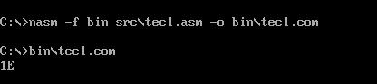

# Laboratorio Unidad 9 - Interrupciones y Puertos en NASM

## Descripción
Implementación de programas en ensamblador x86 utilizando interrupciones BIOS/DOS y acceso a puertos mediante polling para el manejo de teclado e impresión.

## Estructura del proyecto
- src/ → códigos fuente ASM
- bin/ → ejecutables COM
- capturas/ → evidencias de ejecución

## Programas
- tecl.asm → lectura de teclado con interrupciones
- poll_t.asm → polling del teclado
- lpt1.asm → envío de caracteres al puerto LPT1

## Tecnologías
- NASM
- DOSBox
- Arquitectura x86

## Evidencias
## 1: Lectura del teclado mediante el puerto 8042

Se implementó la lectura del registro de estado del controlador de teclado 8042 utilizando polling sobre el puerto 64h y lectura del scancode desde el puerto 60h.

